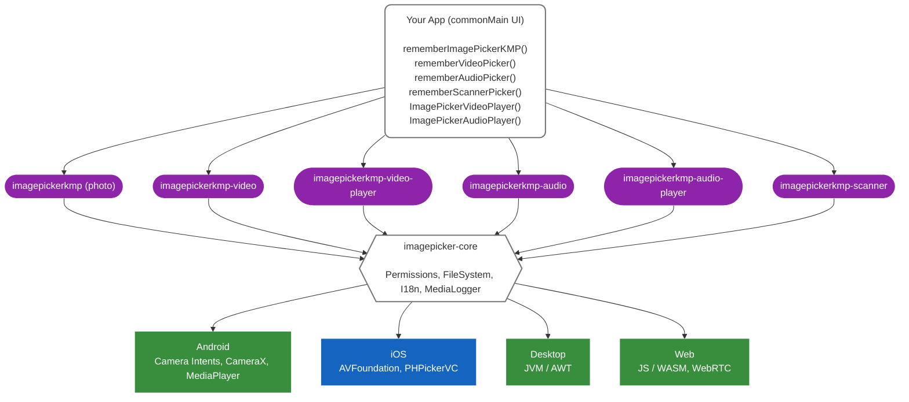
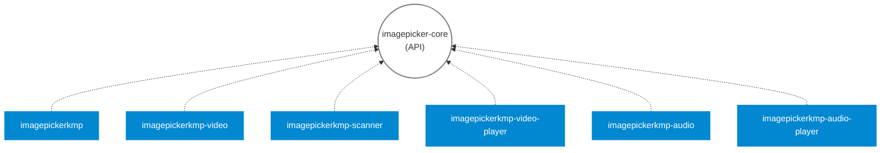
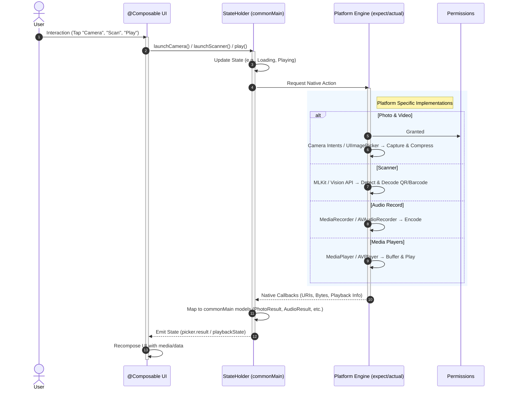

# ImagePickerKMP

**A complete media library for Kotlin Multiplatform — photos, video, audio, scanning, and playback in one ecosystem.**


<p align="center">
  
</p>

<p align="center">
  <a href="https://github.com/ismoy/ImagePickerKMP/actions"></a>
  <a href="https://codecov.io/gh/ismoy/ImagePickerKMP"></a>
  <a href="https://opensource.org/licenses/MIT"></a>
  <a href="https://kotlinlang.org"></a>
  <a href="https://github.com/ismoy/ImagePickerKMP/stargazers"></a>
</p>

<p align="center">
  <a href="https://search.maven.org/search?q=g:io.github.ismoy+a:imagepicker-core"></a>
  <a href="https://search.maven.org/search?q=g:io.github.ismoy+a:imagepickerkmp"></a>
  <a href="https://search.maven.org/search?q=g:io.github.ismoy+a:imagepickerkmp-video"></a>
  <a href="https://search.maven.org/search?q=g:io.github.ismoy+a:imagepickerkmp-audio"></a>
  <a href="https://search.maven.org/search?q=g:io.github.ismoy+a:imagepickerkmp-scanner"></a>
</p>

<p align="center">
  
  
  
  
  
</p>

<p align="center">
  <a href="https://imagepickerkmp.dev/">
    
  </a>
  &nbsp;
  <a href="https://github.com/ismoy/CameraKMP">
    
  </a>
  &nbsp;
  <a href="https://github.com/sponsors/ismoy">
    
  </a>
</p>

---

## The Ecosystem

ImagePickerKMP is a **modular** media library. Each module is independent — include only what your app needs.

| Module | Artifact | Description |
|--------|----------|-------------|
| **Photo** | `imagepickerkmp` | Camera capture and gallery image picking |
| **Video** | `imagepickerkmp-video` | Video recording and gallery video picking |
| **Audio** | `imagepickerkmp-audio` | Audio recording with waveform visualization |
| **Audio Player** | `imagepickerkmp-audio-player` | Voice message / audio file playback |
| **Scanner** | `imagepickerkmp-scanner` | Barcode and QR code scanning via live camera |
| **Video Player** | `imagepickerkmp-video-player` | Full-featured video playback with controls |

> **Requirements:** Kotlin **2.3.20** · Compose Multiplatform **1.11.1** · Android `minSdk` **24** · iOS **16.0+**

---
## Installation

Add only the modules you need. All modules are published to Maven Central.

```kotlin
// build.gradle.kts (commonMain)
dependencies {
    // Photo — camera capture and gallery image picking
    implementation("io.github.ismoy:imagepickerkmp:1.1.0")

    // Video — video recording and gallery video picking
    implementation("io.github.ismoy:imagepickerkmp-video:1.1.0") // SOON

    // Audio — audio recording
    implementation("io.github.ismoy:imagepickerkmp-audio:1.1.0") // SOON

    // Audio Player — voice message and audio file playback
    implementation("io.github.ismoy:imagepickerkmp-audioplayer:1.1.0") // SOON

    // Scanner — live barcode and QR code scanning
    implementation("io.github.ismoy:imagepickerkmp-scanner:1.1.0") // SOON

    // Video Player — full-featured video playback
    implementation("io.github.ismoy:imagepickerkmp-videoplayer:1.1.0") // SOON
}
```

### iOS — `Info.plist`

Every module that uses the camera or microphone requires a usage description. Add the ones relevant to your app:

```xml
<!-- Camera (Photo, Video, Scanner) -->
<key>NSCameraUsageDescription</key>
<string>Required for camera features.</string>

<!-- Microphone (Video, Audio) -->
<key>NSMicrophoneUsageDescription</key>
<string>Required to record audio.</string>

<!-- Photo Library (Photo, Video) -->
<key>NSPhotoLibraryUsageDescription</key>
<string>Required to select media from your library.</string>
```
---

##  Internationalization (i18n)

ImagePickerKMP features out-of-the-box automatic translation (powered by the **i18nKonfig** Gradle plugin created by Ismoy Belizaire). The UI components will automatically detect the user's device language and display localized strings (permissions, camera UI, etc.) without any extra setup.

Currently, we support **12 languages** including English, Spanish, French, Chinese, Japanese, and more. 

**Want to add your language?** We welcome community contributions! 
Head over to the [Core Module README](imagepicker-core/README.md) to learn how to fork the repository, add your language to the `translations.yaml` file, and submit a Pull Request.

---

## Module Quick Start

### Photo — `imagepickerkmp`

Pick images from the gallery or capture with the camera using a single Compose state holder.

```kotlin
@Composable
fun PhotoScreen() {
    val picker = rememberImagePickerKMP(
        config = ImagePickerKMPConfig(
            galleryConfig = GalleryConfig(allowMultiple = true, selectionLimit = 10),
            cropConfig    = CropConfig(enabled = true)
        )
    )

    Button(onClick = { picker.launchCamera() }) { Text("Camera") }
    Button(onClick = { picker.launchGallery() }) { Text("Gallery") }

    when (val result = picker.result) {
        is ImagePickerResult.Success   -> result.photos.forEach { photo ->
            Image(painter = photo.loadPainter(), contentDescription = null)
        }
        is ImagePickerResult.Loading   -> CircularProgressIndicator()
        is ImagePickerResult.Error     -> Text("Error: ${result.exception.message}")
        is ImagePickerResult.Dismissed -> Unit
        is ImagePickerResult.Idle      -> Unit
    }
}
```

→ [Full Photo documentation](imagepickerkmp-photo/README.md)

---

### Video — `imagepickerkmp-video`

Record video or pick from the gallery. Supports compression, metadata, and multiple formats.

```kotlin
@Composable
fun VideoScreen() {
    val picker = rememberVideoPicker(
        config = VideoPickerConfig(
            audio = AudioConfig.Default,
            output = VideoOutputConfig(
                format = VideoOutputFormat.MP4,
                removeMetadata = false
            ),
            allowedMimeTypes = listOf(VideoMimeType.All)
        )
    )

    Button(onClick = { picker.launchCamera() })  { Text("Record") }
    Button(onClick = { picker.launchGallery() }) { Text("Pick Video") }

    when (val result = picker.result) {
        is VideoPickerState.Success -> Text("Duration: ${result.video.durationMs}ms")
        is VideoPickerState.Error   -> Text("Error: ${result.cause}")
        else -> Unit
    }
}
```

→ [Full Video documentation](imagepickerkmp-video/README.md)

---

### Audio — `imagepickerkmp-audio`

Two APIs — an inline chat-style mic widget and a modal state-holder.

**Inline widget** — embeds a hold-to-record mic button directly in your layout:

```kotlin
@Composable
fun ChatInputBar() {
    AudioRecorder(
        config   = AudioRecorderConfig(),
        onResult = { audioResult: AudioResult? ->
            if (audioResult != null) {
                println("Recorded: ${audioResult.uri}, ${audioResult.durationMs}ms")
            }
        }
    )
}
```

**Modal picker** — opens recorder or gallery in a dialog, same state-holder pattern as the other modules:

```kotlin
@Composable
fun AudioScreen() {
    val picker = rememberAudioPicker()

    Button(onClick = { picker.launchRecorder() }) { Text("Record") }
    Button(onClick = { picker.launchGallery() })  { Text("Pick Audio") }

    when (val state = picker.result) {
        is AudioPickerState.Success -> Text("Saved: ${state.audio.fileName}")
        else -> Unit
    }
}
```

→ [Full Audio documentation](imagepickerkmp-audio/README.md)

---

### Audio Player — `imagepickerkmp-audio-player`

Low-level playback engine. Powers the `ImagePickerAudioPlayer` composable in `imagepickerkmp-audio` and can be used directly to build fully custom player UIs.

```kotlin
@Composable
fun CustomPlayerScreen(audioUri: String) {
    val playerManager = rememberAudioPlayerManager()
    val state by playerManager.playbackState.collectAsState()

    LaunchedEffect(audioUri) { playerManager.prepare(audioUri) }

    LinearProgressIndicator(
        progress = {
            if (state.durationMs > 0) state.currentPositionMs.toFloat() / state.durationMs else 0f
        }
    )

    FloatingActionButton(
        onClick = {
            if (state.isPlaying) playerManager.pause()
            else playerManager.play(audioUri)
        }
    ) {
        Icon(
            imageVector = if (state.isPlaying) Icons.Default.Pause else Icons.Default.PlayArrow,
            contentDescription = null
        )
    }
}
```

→ [Full Audio Player documentation](imagepickerkmp-audio-player/README.md)

---

### Scanner — `imagepickerkmp-scanner`

Scan barcodes and QR codes from a live camera feed. Supports 19 barcode formats.

```kotlin
@Composable
fun ScannerScreen() {
    val scanner = rememberScannerPicker(
        config = ScannerPickerConfig(
            camera = ScannerCameraConfig(
                behavior = ScannerBehaviorConfig(
                    allowedFormats = listOf(BarcodeFormat.QR_CODE, BarcodeFormat.EAN_13)
                )
            )
        )
    )

    Button(onClick = { scanner.launchScanner() }) { Text("Scan") }

    when (val result = scanner.result) {
        is ScannerPickerState.Success -> Text("Scanned: ${result.result.code}")
        is ScannerPickerState.Error   -> Text("Error: ${result.error}")
        else -> Unit
    }
}
```

→ [Full Scanner documentation](imagepickerkmp-scanner/README.md)

---

### Video Player — `imagepickerkmp-video-player`

Full-featured video player with play/pause, seek, volume, fullscreen, and quality selection.

```kotlin
@Composable
fun VideoPlayerScreen(videoUrl: String) {
    ImagePickerVideoPlayer(
        source = VideoSource.Url(videoUrl),
        config = VideoPlayerConfig(
            behavior = VideoBehaviorConfig(autoPlay = true)
        )
    )
}
```

For programmatic control (play/pause from code), use `rememberVideoPlayerState`:

```kotlin
val player = rememberVideoPlayerState(source = VideoSource.Url(videoUrl))
ImagePickerVideoPlayer(state = player, config = VideoPlayerConfig())
player.seekTo(30_000L)
```

→ [Full Video Player documentation](imagepickerkmp-video-player/README.md)

---

## Platform Support Matrix

| Feature | Android | iOS | Desktop | JS/Web | WASM |
|---------|:-------:|:---:|:-------:|:------:|:----:|
| Photo — Camera | ✅ | ✅ | ❌ | ❌ | ❌ |
| Photo — Gallery | ✅ | ✅ | ✅ | ✅ | ✅ |
| Photo — Crop | ✅ | ✅ | ❌ | ❌ | ❌ |
| Photo — EXIF | ✅ | ✅ | ❌ | ❌ | ❌ |
| Video — Camera | ✅ | ✅ | ❌ | ❌ | ❌ |
| Video — Gallery | ✅ | ✅ | ✅ | ✅ | ✅ |
| Audio — Record | ✅ | ✅ | ✅ | ❌ | ❌ |
| Audio — Player | ✅ | ✅ | ✅ | ✅ | ✅ |
| Scanner | ✅ | ✅ | ❌ | ❌ | ❌ |
| Video Player | ✅ | ✅ | ✅ | ✅ | ✅ |

---

## `PhotoResult` — Shared Result Model

All photo operations return a `PhotoResult` with consistent extension functions across platforms:

```kotlin
val photo: PhotoResult = result.photos.first()

// Compose UI
val painter = photo.loadPainter()       // Painter for Image()
val bitmap  = photo.loadImageBitmap()  // ImageBitmap for Canvas

// Raw data
val bytes  = photo.loadBytes()         // ByteArray
val base64 = photo.loadBase64()        // Base64-encoded string

// File system (kotlinx-io)
val path   = photo.asPath()            // kotlinx.io.files.Path
val exists = photo.exists()            // Boolean
val source = photo.asSource()          // Buffered Source

// Transfer
photo.transferToSink(mySink)           // Copy to RawSink
```

---

## Documentation

| Guide | Description |
|-------|-------------|
| [Changelog](docs/CHANGELOG.md) | Release history and migration notes |
| [Contributing](docs/CONTRIBUTING.md) | How to contribute |
| [Examples](docs/EXAMPLES.md) | Full code examples |
| [Integration Guide](docs/INTEGRATION_GUIDE.md) | Gradle setup, iOS config, ProGuard |
| [FAQ](docs/FAQ.md) | Common questions and troubleshooting |
| [Privacy Guide](docs/PRIVACY_GUIDE.md) | GDPR, GPS redaction, metadata handling |
| [Security](docs/SECURITY.md) | Reporting vulnerabilities |

---

## Contributing

Contributions are welcome. See [CONTRIBUTING.md](docs/CONTRIBUTING.md) for setup instructions, code style, and the pull request process.

- [Report a bug](https://github.com/ismoy/ImagePickerKMP/issues/new?template=bug_report.md)
- [Request a feature](https://github.com/ismoy/ImagePickerKMP/issues/new?template=feature_request.md)
- [Discord community](https://discord.gg/EjSQTeyh)

---

## Sponsors

ImagePickerKMP is free and open source. Maintaining it across five platforms with every Kotlin and Compose Multiplatform release takes significant effort. If this library saves you time in production, please consider sponsoring.

<!-- SPONSORS-LIST:START - Do not remove or modify this section -->
<table>
  <tr>
    <td align="center">
      <a href="https://github.com/james-codersHT" title="james-codersHT · Silver Sponsor">
        <br/>
        <sub><b>james-codersHT</b></sub>
      </a>
    </td>
  </tr>
</table>
<!-- SPONSORS-LIST:END -->

[→ Become a sponsor](https://github.com/sponsors/ismoy)

---

## Architecture

ImagePickerKMP follows a layered architecture. All platform-specific logic lives inside each module's `androidMain` / `iosMain` source sets. Your app code only ever touches the `commonMain` API.



### Module dependency graph



All modules expose `imagepicker-core` as an `api` dependency, so `PermissionManager`, `MediaLogger`, `I18nKonfig`, and `PlatformUri` are available in your app without an extra dependency declaration.

### Data flow — Architecture Lifecycle



---

## Contributors

<!-- ALL-CONTRIBUTORS-LIST:START - Do not remove or modify this section -->
<!-- prettier-ignore-start -->
<!-- markdownlint-disable -->
<table>
  <tbody>
    <tr>
      <td align="center" valign="top" width="14.28%">
        <a href="https://github.com/ismoy">
          <br />
          <sub><b>ismoy</b></sub>
        </a><br />
        <a href="https://github.com/ismoy/ImagePickerKMP/commits?author=ismoy" title="Contributions">💻 📖 🚧 🎨 🤔</a>
      </td>
      <td align="center" valign="top" width="14.28%">
        <a href="https://github.com/medAndro">
          <br />
          <sub><b>medAndro</b></sub>
        </a><br />
        <a href="https://github.com/ismoy/ImagePickerKMP/commits?author=medAndro" title="Contributions">💻 🐛</a>
      </td>
      <td align="center" valign="top" width="14.28%">
        <a href="https://github.com/YaminMahdi">
          <br />
          <sub><b>YaminMahdi</b></sub>
        </a><br />
        <a href="https://github.com/ismoy/ImagePickerKMP/commits?author=YaminMahdi" title="Contributions">💻</a>
      </td>
      <td align="center" valign="top" width="14.28%">
        <a href="https://github.com/jadlr">
          <br />
          <sub><b>jadlr</b></sub>
        </a><br />
        <a href="https://github.com/ismoy/ImagePickerKMP/commits?author=jadlr" title="Contributions">💻</a>
      </td>
      <td align="center" valign="top" width="14.28%">
        <a href="https://github.com/b1jarosz">
          <br />
          <sub><b>b1jarosz</b></sub>
        </a><br />
        <a href="https://github.com/ismoy/ImagePickerKMP/commits?author=b1jarosz" title="Contributions">💻</a>
      </td>
      <td align="center" valign="top" width="14.28%">
        <a href="https://github.com/daniil-pastuhov">
          <br />
          <sub><b>daniil-pastuhov</b></sub>
        </a><br />
        <a href="https://github.com/ismoy/ImagePickerKMP/commits?author=daniil-pastuhov" title="Contributions">💻</a>
      </td>
      <td align="center" valign="top" width="14.28%">
        <a href="https://github.com/x-sheep">
          <br />
          <sub><b>x-sheep</b></sub>
        </a><br />
        <a href="https://github.com/ismoy/ImagePickerKMP/commits?author=x-sheep" title="Contributions">💻</a>
      </td>
    </tr>
    <tr>
      <td align="center" valign="top" width="14.28%">
        <a href="https://github.com/Magmi183">
          <br />
          <sub><b>Magmi183</b></sub>
        </a><br />
        <a href="https://github.com/ismoy/ImagePickerKMP/commits?author=Magmi183" title="Contributions">💻</a>
      </td>
      <td align="center" valign="top" width="14.28%">
        <a href="https://github.com/azevio">
          <br />
          <sub><b>azevio</b></sub>
        </a><br />
        <a href="https://github.com/ismoy/ImagePickerKMP/commits?author=azevio" title="Contributions">💻</a>
      </td>
      <td align="center" valign="top" width="14.28%">
        <a href="https://github.com/fanqieVip">
          <br />
          <sub><b>fanqieVip</b></sub>
        </a><br />
        <a href="https://github.com/ismoy/ImagePickerKMP/commits?author=fanqieVip" title="Contributions">💻</a>
      </td>
    </tr>
  </tbody>
</table>
<!-- markdownlint-restore -->
<!-- prettier-ignore-end -->
<!-- ALL-CONTRIBUTORS-LIST:END -->

---

**MIT License** · Made with ❤️ for the Kotlin Multiplatform community · [⭐ Star this repo](https://github.com/ismoy/ImagePickerKMP)
